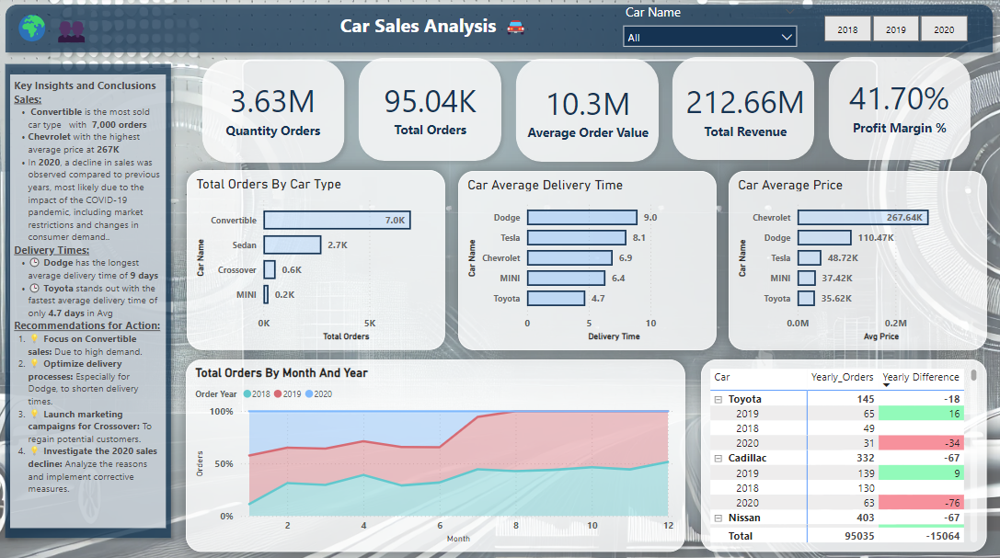
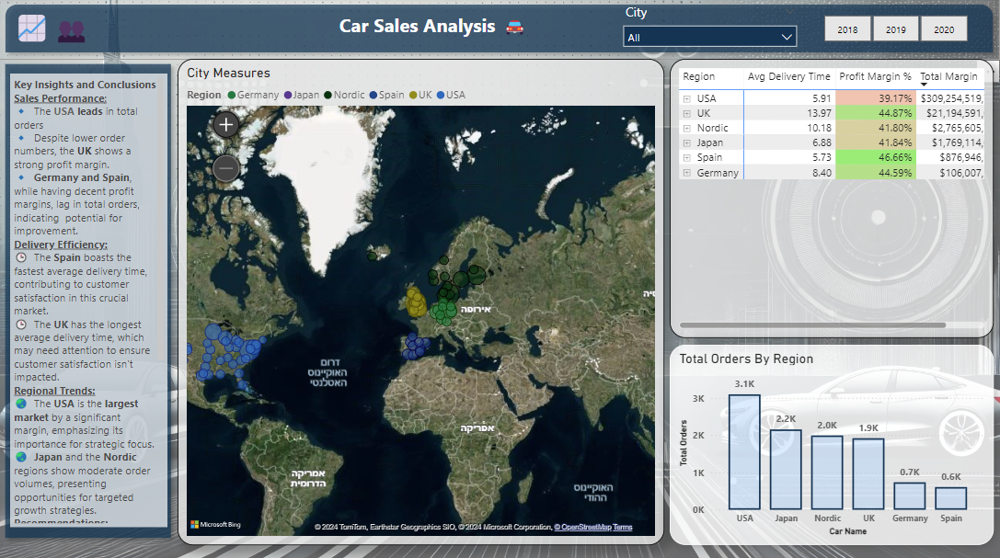
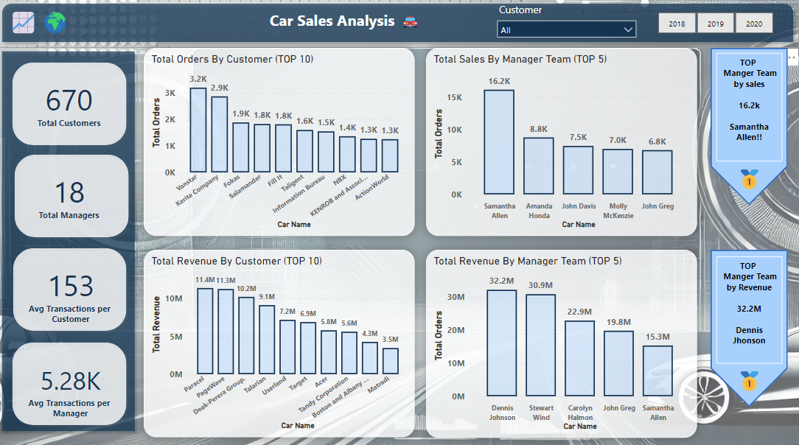

# Car Sales Analysis 🚗

## Introduction
A comprehensive project designed to analyze car sales data, providing insights into sales trends, regional performance, customer behavior, and product efficiency. The project combines SQL for data analysis and Power BI for creating impactful visualizations.

---

## 📂 Files Included

1. **SQL Scripts**
   - `Car_Sales_Analysis.sql`: Contains SQL queries for data cleaning, aggregation, and advanced analysis.
   - `Table_Creation.sql`: SQL script for creating the necessary database tables.
   - `Car_Sales_Views.sql`: SQL script for creating views that simplify exporting data to Power BI.

2. **Power BI Dashboard**
   - `CarSales.pbix`: Power BI dashboard file for visual analysis.

3. **Datasets**
   - `Sales Rep Master.csv`: Data about sales representatives.
   - `Sales.csv`: Detailed sales transaction data.
   - `City Master.csv`: Metadata about cities.
   - `Customers Master.csv`: Customer demographic information.
   - `Item Master.csv`: Product details (car models, types, etc.).
---

## 📊 Dashboards Overview

1. **Main Dashboard**
   - Highlights key metrics such as total orders, revenue, profit margins, and average delivery times.
   - Includes visual breakdowns by car type, year, and regions.

2. **Regional Analysis**
   - Displays sales distribution across different countries and cities.
   - Shows insights into delivery times, profit margins, and regional performance.

3. **Customer and Manager Analysis**
   - Identifies top customers and managers based on sales and revenue.
   - Highlights customer transactions and team performance.

---

## 📈 Insights

1. **Sales Trends**
   - **Top Car Type**: Convertible cars lead with over 7,000 orders.
   - **Top Average Price**: Chevrolet has the highest average price ($267K).
   - **2020 Sales Decline**: A significant decrease in sales and revenue was observed in 2020, primarily due to the COVID-19 pandemic. This decline can be attributed to market restrictions, changes in consumer demand, and logistical challenges.

2. **Delivery Insights**
   - **Longest Delivery Time**: Dodge, with an average of 9 days.
   - **Fastest Delivery**: Toyota, with only 4.7 days.

3. **Regional Performance**
   - The USA dominates sales volume, followed by the UK and Nordic regions.
   - Spain getting the fastest delivery services, enhancing customer satisfaction.

---

## 🛠️ How to Use

### 1. **Setup the Database**
   - Start by loading the `Table_Creation.sql` script into your database platform. This script will create all the necessary tables for the analysis.

### 2. **Import the Data**
   - Import the provided CSV files into the corresponding tables:
     - `Sales Rep Master.csv` → Sales Representatives Table
     - `Sales.csv` → Sales Table
     - `City Master.csv` → City Metadata Table
     - `Customers Master.csv` → Customers Table
     - `Item Master.csv` → Product Table

### 3. **Run Analysis Queries**
   - Open the `Car_Sales_Analysis.sql` file to review and execute SQL queries for cleaning, aggregating, and analyzing the data. This step will provide initial insights into sales trends, delivery efficiency, and regional performance.

### 4. **Create Views**
   - Execute the `Car_Sales_Views.sql` script to create SQL views. These views simplify exporting data to Power BI by consolidating and structuring the data for easy visualization.

### 5. **Load Data into Power BI**
   - Open the `CarSales.pbix` file in Power BI Desktop.
   - Connect Power BI to the views created in the database to ensure dynamic and accurate data representation.
   - Explore the dashboards to analyze trends, performance metrics, and actionable insights.

